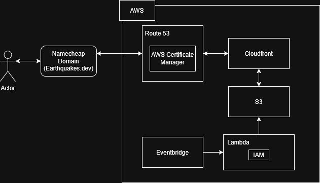

# global earthquake tracking

- a web project to learn more about web development, cloud, data, and GIS
- this aim of this project is to provide a performant and user friendly way to visualize earthquakes
that have occured globally within the last 30 days based on USGS earthquake data.

## tech stack
- javascript for user interface development (leaflet maps)
- AWS for automated data retrieval and storage (lambda, S3)
- python and GeoJSON for data retrieval (requests, plotly initially)
- github pages (for public access)

## Systems Design

### What I learned about AWS

#### setting up static site retrieval and domain name

I decided I wanted a .dev domain and wanted to use AWS services to store data and the static web pages. AWS route53, its domain name service, does not cover .dev domains, so I purchased one from namecheap.
 
 
From there, I needed to learn how to serve static web content from AWS. A good solution seemed to be to use s3 buckets to store html/css/javascript files and then serve them to users. However, one issue
with this is that depending on the number of requests the bucket receives, using s3 to store the files could be expensive. This is where Cloudfront comes in. Cloudfront acts as a CDN for the requests so that
content can be viewed quickly across the globe (via caching), users cannot directly request the s3 contents, and in turn the files are secured and s3 files cannot be directly accessed, reducing or even getting rid of request costs
 (at least for smaller cases such as this website).
 
 
The next part is figuring out how to reroute a request on my domain to cloudfront on AWS while maintaining security. For this I had to create a hosted zone for my domain. By default, the hosted zone will create named servers (NS)
and SOA (Start of Authority) record type. From here, I added the 4 named servers to the nameservers list with the custom DNS option on my Namecheap domain management/settings (under Domain List). I then had to also configure security
for the website by creating an SSL/TLS certificate using AWS Certificate Manager. Upon generation, the certificate was added to the records of the hosted zone for my domain. Lastly, I set up the connection to cloudfront via Route53
by adding two A records for aliasing to the cloudfront URL. One for earthquakes.dev and one for www.earthquakes.dev. This was my first time setting up a website on AWS, so it was quite tedious, but in hindsight, I think it's good
information to know as a developer. Next I'll need to configure set up for updating the USGS earthquake data. This will be done using Eventbridge and Lambda.

#### setting up AWS Eventbridge and Lambda to update file on S3
